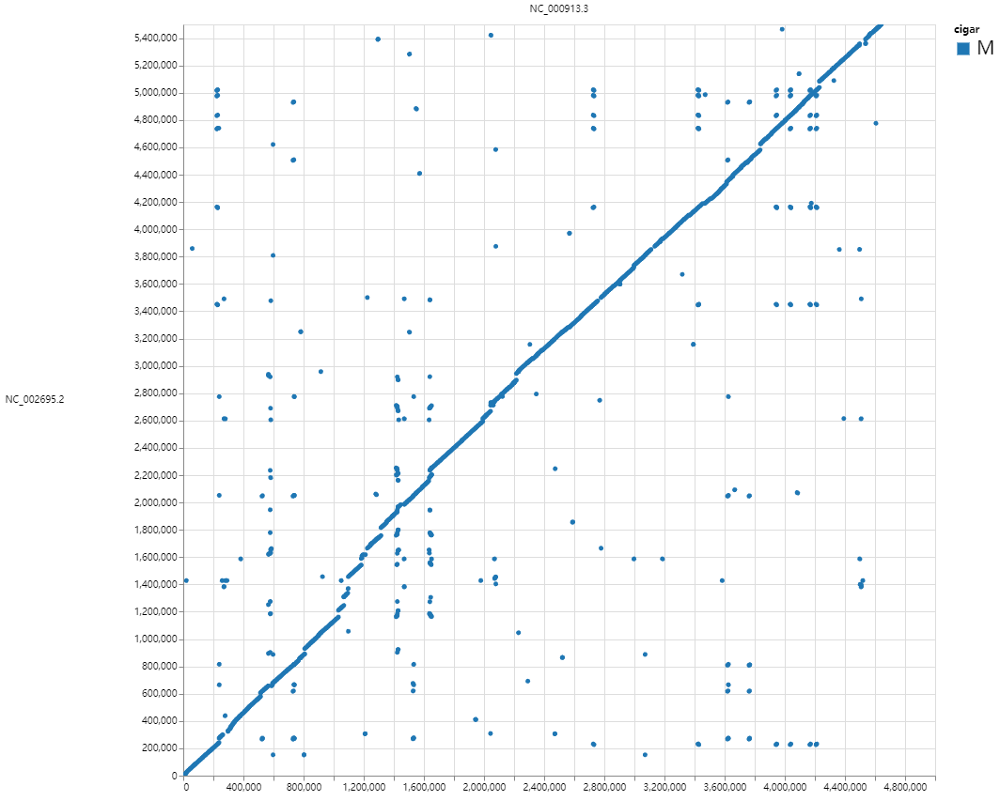
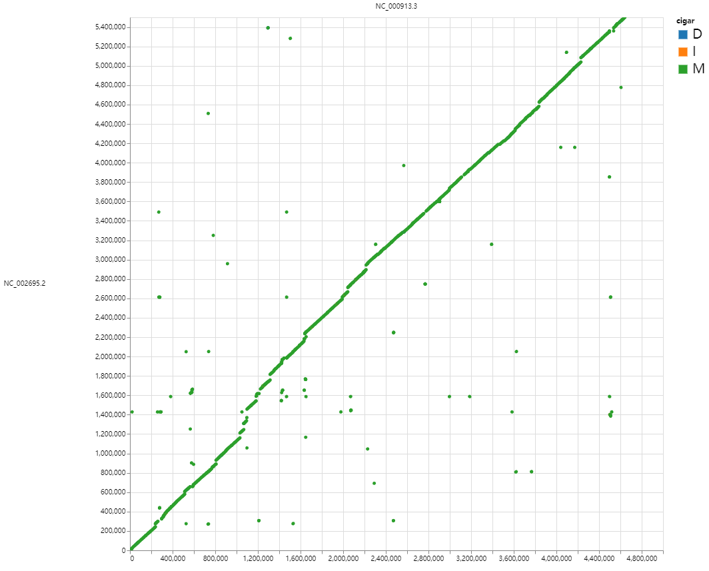
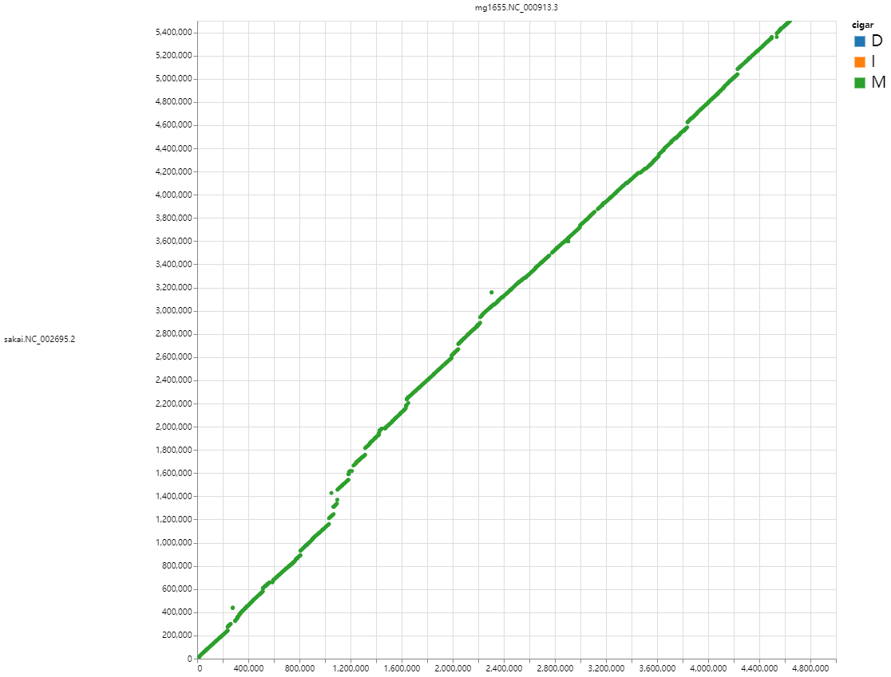
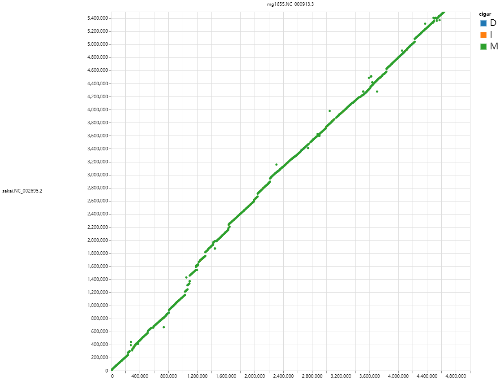

# pgr - Population Genomes Refiner

[](https://github.com/wang-q/pgr/actions)
[](https://codecov.io/gh/wang-q/pgr)
[](https://github.com//wang-q/pgr)

<!-- TOC -->
* [pgr - Population Genomes Refiner](#pgr---population-genomes-refiner)
  * [Install](#install)
  * [Synopsis](#synopsis)
    * [`pgr help`](#pgr-help)
    * [`fasr help`](#fasr-help)
  * [Examples](#examples)
    * [Genomes](#genomes)
    * [Block FA files](#block-fa-files)
  * [Author](#author)
  * [License](#license)
<!-- TOC -->

## Install

Current release: 0.1.0

```bash
cargo install --path . --force #--offline

# test
cargo test -- --test-threads=1

# build under WSL 2
mkdir -p /tmp/cargo
export CARGO_TARGET_DIR=/tmp/cargo
cargo build

```

## Synopsis

### `pgr help`

### `fasr help`

```text
`fasr` operates block fasta files

Usage: fasr [COMMAND]

Commands:
  axt2fas    Convert axt to block fasta
  check      Check genome locations in block fasta headers
  concat     Concatenate sequence pieces of the same species
  consensus  Generate consensus sequences by POA
  cover      Output covers on chromosomes
  create     Create block fasta files from links of ranges
  filter     Filter blocks, and can also be used as a formatter
  join       Join multiple block fasta files by a common target
  link       Output bi/multi-lateral range links
  maf2fas    Convert maf to block fasta
  name       Output all species names
  pl-p2m     Pipeline - pairwise alignments to multiple alignments
  refine     Realign files with external programs and trim unwanted regions
  replace    Concatenate sequence pieces of the same species
  separate   Separate block fasta files by species
  slice      Extract alignment slices
  split      Split block fasta files to per-alignment/chromosome fasta files
  stat       Extract a subset of species
  subset     Extract a subset of species
  variation  List variations (substitutions/indels)
  xlsx       List variations (substitutions/indels)
  help       Print this message or the help of the given subcommand(s)

Options:
  -h, --help     Print help
  -V, --version  Print version

```

## Examples

### Genomes

* genomes

```bash
curl -L https://ftp.ncbi.nlm.nih.gov/genomes/all/GCF/000/005/845/GCF_000005845.2_ASM584v2/GCF_000005845.2_ASM584v2_genomic.fna.gz |
    gzip -dc |
    hnsm filter stdin -s |
    hnsm gz stdin -o tests/pgr/mg1655.fa

curl -L https://ftp.ncbi.nlm.nih.gov/genomes/all/GCF/000/008/865/GCF_000008865.2_ASM886v2/GCF_000008865.2_ASM886v2_genomic.fna.gz |
    gzip -dc |
    hnsm filter stdin -s |
    hnsm gz stdin -o tests/pgr/sakai.fa

```

* `hnsm distance`

```bash
hnsm distance tests/pgr/sakai.fa.gz tests/pgr/mg1655.fa.gz --hasher mod -k 21 -w 1
#NC_002695       NC_000913       0.0221  0.4580  0.5881
#NC_002127       NC_000913       0.6640  0.0000  0.0006
#NC_002128       NC_000913       0.4031  0.0001  0.0053

hnsm rc tests/pgr/mg1655.fa.gz |
    hnsm distance tests/pgr/sakai.fa.gz stdin --hasher mod -k 21 -w 1
#NC_002695       RC_NC_000913    0.0221  0.4580  0.5881
#NC_002127       RC_NC_000913    0.6640  0.0000  0.0006
#NC_002128       RC_NC_000913    0.4031  0.0001  0.0053

hnsm rc tests/pgr/mg1655.fa.gz |
    hnsm distance tests/pgr/mg1655.fa.gz stdin --hasher mod -k 21 -w 1
#NC_000913       RC_NC_000913    0.0000  1.0000  1.0000
hnsm rc tests/pgr/mg1655.fa.gz |
    hnsm distance tests/pgr/mg1655.fa.gz stdin --hasher rapid -k 21 -w 1
#NC_000913       RC_NC_000913    0.2289  0.0041  0.0082

hnsm distance tests/pgr/sakai.fa.gz tests/pgr/mg1655.fa.gz --merge --hasher mod -k 21 -w 1
#tests/pgr/sakai.fa.gz   tests/pgr/mg1655.fa.gz  5302382 4543891 3064483 6781790 0.0226  0.4519  0.5779

hnsm distance tests/pgr/sakai.fa.gz tests/pgr/mg1655.fa.gz --merge --hasher rapid -k 21 -w 1
#tests/pgr/sakai.fa.gz   tests/pgr/mg1655.fa.gz  5394043 4562542 3071076 6885509 0.0230  0.4460  0.5693

echo -e "tests/pgr/sakai.fa.gz\ntests/pgr/mg1655.fa.gz" |
    hnsm distance stdin --merge --list --hasher mod -k 21 -w 1
#tests/pgr/sakai.fa.gz   tests/pgr/sakai.fa.gz   5302382 5302382 5302382 5302382 0.0000  1.0000  1.0000
#tests/pgr/sakai.fa.gz   tests/pgr/mg1655.fa.gz  5302382 4543891 3064483 6781790 0.0226  0.4519  0.5779
#tests/pgr/mg1655.fa.gz  tests/pgr/sakai.fa.gz   4543891 5302382 3064483 6781790 0.0226  0.4519  0.6744
#tests/pgr/mg1655.fa.gz  tests/pgr/mg1655.fa.gz  4543891 4543891 4543891 4543891 0.0000  1.0000  1.0000

```

* plot

```bash
FastGA -v -pafx tests/pgr/sakai.fa.gz tests/pgr/mg1655.fa.gz > tmp.paf
FastGA -v -psl tests/pgr/sakai.fa.gz tests/pgr/mg1655.fa.gz > tmp.psl

pgr chain -t="" tests/pgr/mg1655.fa.gz tests/pgr/sakai.fa.gz tmp.psl > tmp.chain.maf
pgr chain --syn -t="" tests/pgr/mg1655.fa.gz tests/pgr/sakai.fa.gz tmp.psl > tmp.syn.maf

lastz <(gzip -dcf tests/pgr/mg1655.fa.gz) <(gzip -dcf tests/pgr/sakai.fa.gz) |
    lavToPsl stdin stdout \
    > tmp.lastz.psl
pgr chain --syn -t="" tests/pgr/mg1655.fa.gz tests/pgr/sakai.fa.gz tmp.lastz.psl > tmp.lastz.maf

#wgatools maf2paf tmp.maf -o - |
#    sed 's/sakai\.fa\.//g' |
#    sed 's/mg1655\.fa\.//g' \
#    > tmp.paf
#PAFtoALN tmp.paf tests/pgr/sakai.fa.gz tests/pgr/mg1655.fa.gz
#ALNplot tmp -p -n0

wgatools dotplot -f paf tmp.paf > tmp.html
wgatools dotplot tmp.chain.maf > tmp.chain.html
wgatools dotplot tmp.syn.maf > tmp.syn.html
wgatools dotplot tmp.lastz.maf > tmp.lastz.html

#FastGA -v -1:tmp tests/pgr/sakai.fa.gz tests/pgr/mg1655.fa.gz
#ALNplot tmp -p -n0

```

|  |  |
|:--------------------------:|:------------------------------:|
|            paf             |             chain              |

|  |  |
|:--------------------------:|:------------------------------:|
|            syn             |             lastz              |

* repeats

```bash
# TnCentral
curl -LO https://tncentral.ncc.unesp.br/api/download_blast/nc/tn_in_is

unzip -j tn_in_is 'tncentral_integrall_isfinder.fa'
gzip -9 -c 'tncentral_integrall_isfinder.fa' > tncentral.fa.gz

hnsm size tests/pgr/tncentral.fa.gz
hnsm distance tests/pgr/tncentral.fa.gz -k 17 -w 5 -p 8 |
    rgr filter stdin --ge 5:0.9

# RepBase for RepeatMasker
curl -LO https://github.com/wang-q/ubuntu/releases/download/20190906/repeatmaskerlibraries-20140131.tar.gz

tar xvfz repeatmaskerlibraries-20140131.tar.gz Libraries/RepeatMaskerLib.embl

# https://sourceforge.net/projects/readseq/
java -jar ~/bin/readseq.jar -f fa Libraries/RepeatMaskerLib.embl
mv Libraries/RepeatMaskerLib.embl.fasta repbase.fa
gzip -9 -k repbase.fa

```

* RepeatMasker

```bash
singularity run ~/bin/repeatmasker_master.sif /app/RepeatMasker/RepeatMasker \
    ./genome.fa -xsmall -species "bacteria"

singularity run ~/bin/repeatmasker_master.sif /app/RepeatMasker/util/rmOutToGFF3.pl \
    ./genome.fa.out > mg1655.rm.gff

spanr gff tests/pgr/mg1655.rm.gff -o tests/pgr/mg1655.rm.json

```

```bash
pgr ir tests/pgr/tncentral.fa.gz tests/pgr/mg1655.fa.gz \
    > tests/pgr/mg1655.ir.json

spanr stat tests/pgr/mg1655.chr.sizes tests/pgr/mg1655.ir.json

pgr rept tests/pgr/mg1655.fa.gz \
    > tests/pgr/mg1655.rept.json

pgr trf tests/pgr/mg1655.fa.gz \
    > tests/pgr/mg1655.trf.json

spanr stat tests/pgr/mg1655.chr.sizes tests/pgr/mg1655.rm.json
spanr statop tests/pgr/mg1655.chr.sizes tests/pgr/mg1655.ir.json tests/pgr/mg1655.rm.json

lastz tests/pgr/pseudocat.fa tests/pgr/pseudopig.fa |
    lavToPsl stdin stdout \
    > tests/pgr/lastz.psl

pgr chain tests/pgr/pseudocat.fa tests/pgr/pseudopig.fa tests/pgr/lastz.psl

lastz --self <(gzip -dcf tests/pgr/mg1655.fa.gz)

```

### Block FA files

```bash
fasr maf2fas tests/fasr/example.maf

fasr axt2fas tests/fasr/RM11_1a.chr.sizes tests/fasr/example.axt --qname RM11_1a

fasr filter tests/fasr/example.fas --ge 10

fasr name tests/fasr/example.fas --count

fasr cover tests/fasr/example.fas

fasr cover tests/fasr/example.fas --name S288c --trim 10

fasr concat tests/fasr/name.lst tests/fasr/example.fas

fasr subset tests/fasr/name.lst tests/fasr/example.fas
fasr subset tests/fasr/name.lst tests/fasr/refine.fas --required

fasr link tests/fasr/example.fas --pair
fasr link tests/fasr/example.fas --best

fasr replace tests/fasr/replace.tsv tests/fasr/example.fas
fasr replace tests/fasr/replace.fail.tsv tests/fasr/example.fas

samtools faidx tests/fasr/NC_000932.fa NC_000932:1-10

fasr check tests/fasr/NC_000932.fa tests/fasr/A_tha.pair.fas
fasr check tests/fasr/NC_000932.fa tests/fasr/A_tha.pair.fas --name A_tha

fasr create tests/fasr/genome.fa tests/fasr/I.connect.tsv --name S288c

# Create a fasta file containing multiple genomes
cat tests/fasr/genome.fa | sed 's/^>/>S288c./' > tests/fasr/genomes.fa
samtools faidx tests/fasr/genomes.fa S288c.I:1-100

cargo run --bin fasr create tests/fasr/genomes.fa tests/fasr/I.name.tsv --multi

fasr separate tests/fasr/example.fas -o . --suffix .tmp

spoa tests/fasr/refine.fasta -r 1

fasr consensus tests/fasr/example.fas
fasr consensus tests/fasr/refine.fas
fasr consensus tests/fasr/refine.fas --outgroup -p 2

fasr refine tests/fasr/example.fas
fasr refine tests/fasr/example.fas --msa none --chop 10
fasr refine tests/fasr/refine2.fas --msa clustalw --outgroup
fasr refine tests/fasr/example.fas --quick

fasr split tests/fasr/example.fas --simple
fasr split tests/fasr/example.fas -o . --chr --suffix .tmp

fasr slice tests/fasr/slice.json tests/fasr/slice.fas --name S288c

cargo run --bin fasr join tests/fasr/S288cvsYJM789.slice.fas --name YJM789
cargo run --bin fasr join \
    tests/fasr/S288cvsRM11_1a.slice.fas \
    tests/fasr/S288cvsYJM789.slice.fas \
    tests/fasr/S288cvsSpar.slice.fas

cargo run --bin fasr stat tests/fasr/example.fas --outgroup

cargo run --bin fasr variation tests/fasr/example.fas
cargo run --bin fasr variation tests/fasr/example.fas --outgroup

#fasops xlsx tests/fasr/example.fas -o example.xlsx
#fasops xlsx tests/fasr/example.fas -l 50 --outgroup -o example.outgroup.xlsx
fasr xlsx tests/fasr/example.fas --indel
fasr xlsx tests/fasr/example.fas --indel --outgroup
fasr xlsx tests/fasr/example.fas --nosingle
fasr xlsx tests/fasr/example.fas --indel --nocomplex
fasr xlsx tests/fasr/example.fas --indel --min 0.3 --max 0.7

cargo run --bin fasr pl-p2m tests/fasr/S288cvsRM11_1a.slice.fas tests/fasr/S288cvsSpar.slice.fas

```

## Author

Qiang Wang <wang-q@outlook.com>

## License

MIT.

Copyright by Qiang Wang.

Written by Qiang Wang <wang-q@outlook.com>, 2024-
