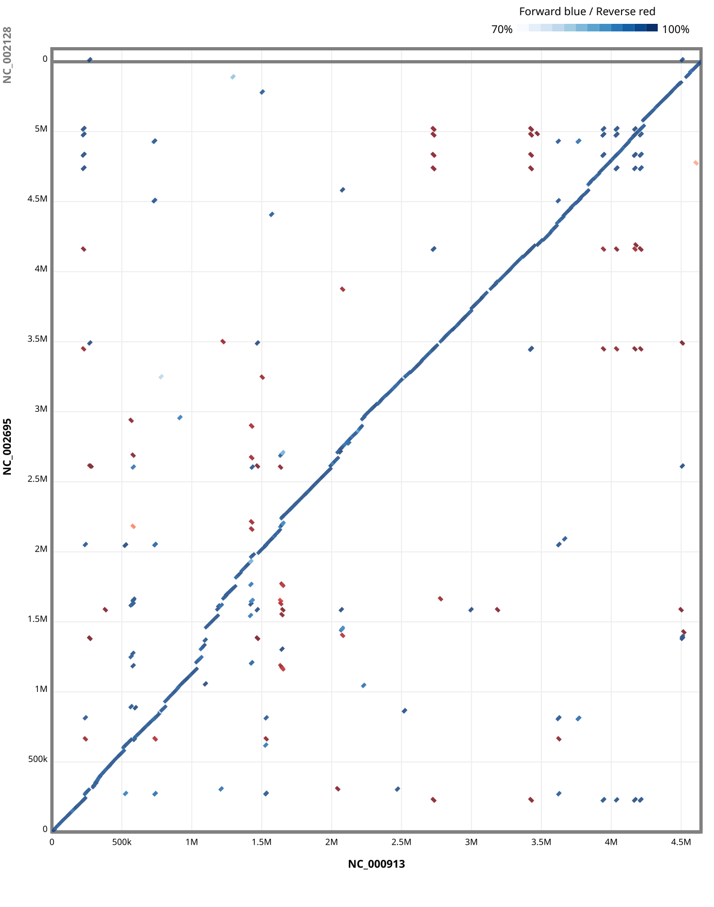
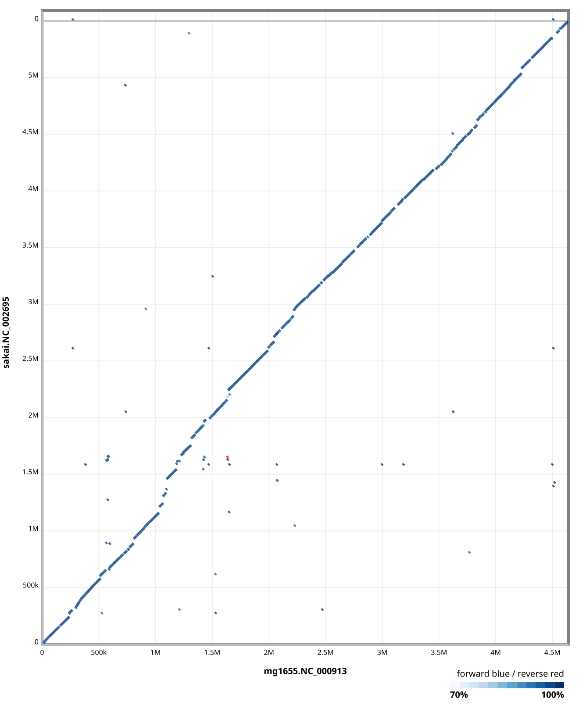
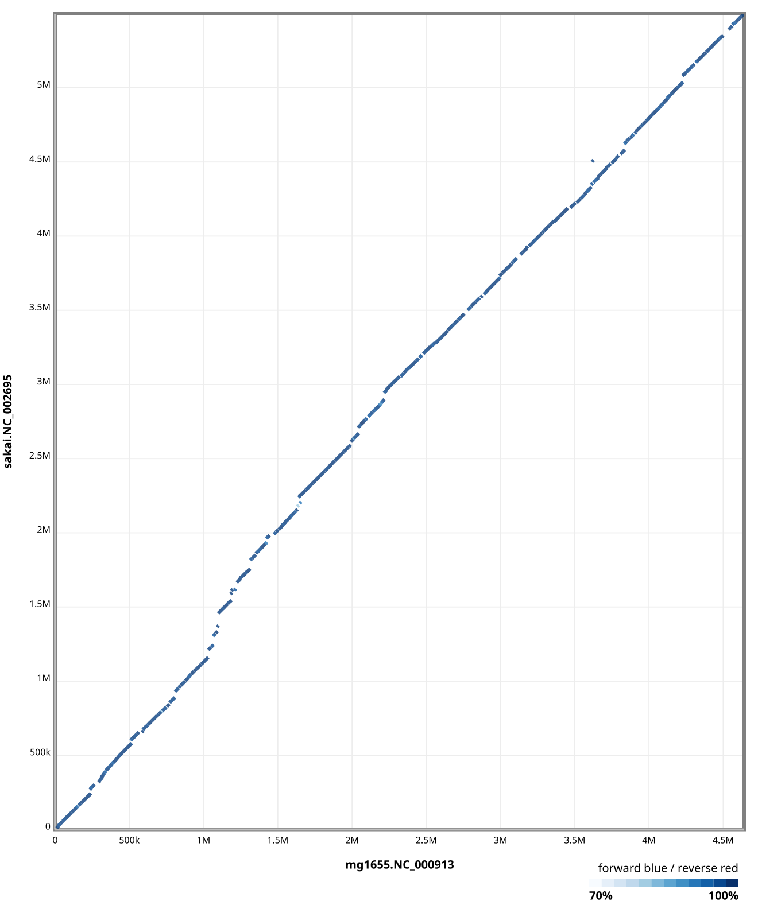
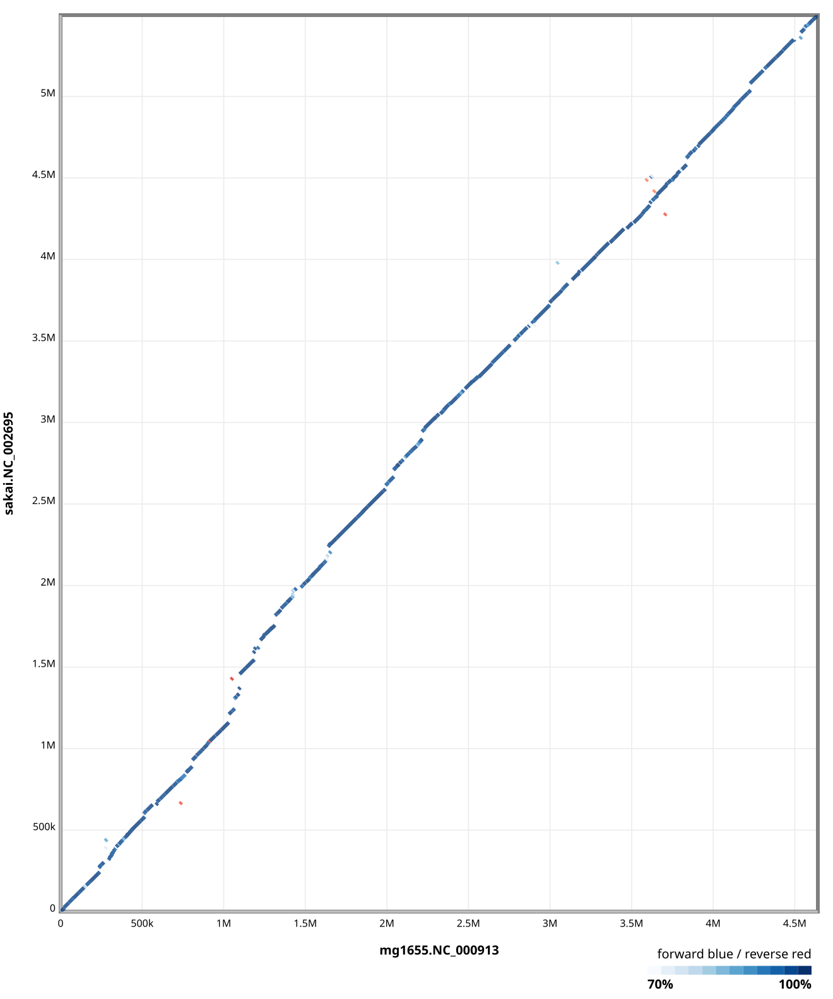

# E. coli genome

使用 MG1655、Sakai 和 SE11 三株大肠杆菌基因组，演示 `pgr` 的 UCSC pipeline 和比对可视化。
MG1655 是 K-12 实验室菌株，Sakai 是 O157:H7 致病菌株，两者基因组大小约 4.6 Mb 和 5.5 Mb；
SE11 是 O152:H28 共生株，除 4.8 Mb 染色体外还携带 6 个质粒，用于多 replicon（多染色体）测试。
另预选 7 株覆盖主要 pathotype 的典型菌株（UPEC / EPEC / EAEC / STEC / ETEC / ST131 ESBL /
益生菌，见下），泛基因组验证已从 3 基因组扩大到 10 基因组并 PASS
（45 对 FastGA → chainnet --syn，见 [[ecoli-cohort.md]] §4）。

## Download

```bash
# MG1655 (K-12)
curl -L https://ftp.ncbi.nlm.nih.gov/genomes/all/GCF/000/005/845/GCF_000005845.2_ASM584v2/GCF_000005845.2_ASM584v2_genomic.fna.gz |
    gzip -dc |
    pgr fa filter stdin --simplify |
    pgr fa gz stdin -o tests/genome/mg1655.fa.gz

# Sakai (O157:H7)
curl -L https://ftp.ncbi.nlm.nih.gov/genomes/all/GCF/000/008/865/GCF_000008865.2_ASM886v2/GCF_000008865.2_ASM886v2_genomic.fna.gz |
    gzip -dc |
    pgr fa filter stdin --simplify |
    pgr fa gz stdin -o tests/genome/sakai.fa.gz

# SE11 (O152:H28, 共生株; RefSeq GCF_000010385.1, ASM1038v1)
# 1 染色体 + 6 质粒 (pSE11-1 ~ pSE11-6)，共 7 个 replicon
curl -L https://ftp.ncbi.nlm.nih.gov/genomes/all/GCF/000/010/385/GCF_000010385.1_ASM1038v1/GCF_000010385.1_ASM1038v1_genomic.fna.gz |
    gzip -dc |
    pgr fa filter stdin --simplify |
    pgr fa gz stdin -o tests/genome/se11.fa.gz

# CFT073 (UPEC, O6:K2:H1)
curl -L https://ftp.ncbi.nlm.nih.gov/genomes/all/GCF/000/007/445/GCF_000007445.1_ASM744v1/GCF_000007445.1_ASM744v1_genomic.fna.gz |
    gzip -dc |
    pgr fa filter stdin --simplify |
    pgr fa gz stdin -o tests/genome/cft073.fa.gz

# E2348/69 (EPEC, O127:H6)
curl -L https://ftp.ncbi.nlm.nih.gov/genomes/all/GCF/000/026/545/GCF_000026545.1_ASM2654v1/GCF_000026545.1_ASM2654v1_genomic.fna.gz |
    gzip -dc |
    pgr fa filter stdin --simplify |
    pgr fa gz stdin -o tests/genome/e2348_69.fa.gz

# 042 (EAEC, O44:H18)
curl -L https://ftp.ncbi.nlm.nih.gov/genomes/all/GCF/000/027/125/GCF_000027125.1_ASM2712v1/GCF_000027125.1_ASM2712v1_genomic.fna.gz |
    gzip -dc |
    pgr fa filter stdin --simplify |
    pgr fa gz stdin -o tests/genome/ec042.fa.gz

# 2011C-3493 (STEC/EAEC 爆发株, O104:H4; 2011 德国 O104:H4 疫情)
curl -L https://ftp.ncbi.nlm.nih.gov/genomes/all/GCF/000/299/455/GCF_000299455.1_ASM29945v1/GCF_000299455.1_ASM29945v1_genomic.fna.gz |
    gzip -dc |
    pgr fa filter stdin --simplify |
    pgr fa gz stdin -o tests/genome/ec2011c_3493.fa.gz

# E24377A (ETEC, O139:H28)
curl -L https://ftp.ncbi.nlm.nih.gov/genomes/all/GCF/000/017/745/GCF_000017745.1_ASM1774v1/GCF_000017745.1_ASM1774v1_genomic.fna.gz |
    gzip -dc |
    pgr fa filter stdin --simplify |
    pgr fa gz stdin -o tests/genome/e24377a.fa.gz

# EC958 (ST131 ESBL UPEC, O25b:H4; 注意要用 .3 完整版，.2 是 WGS scaffold)
curl -L https://ftp.ncbi.nlm.nih.gov/genomes/all/GCF/000/285/655/GCF_000285655.3_EC958.v1/GCF_000285655.3_EC958.v1_genomic.fna.gz |
    gzip -dc |
    pgr fa filter stdin --simplify |
    pgr fa gz stdin -o tests/genome/ec958.fa.gz

# Nissle 1917 (益生菌, O6:K5:H1)
curl -L https://ftp.ncbi.nlm.nih.gov/genomes/all/GCF/000/714/595/GCF_000714595.1_ASM71459v1/GCF_000714595.1_ASM71459v1_genomic.fna.gz |
    gzip -dc |
    pgr fa filter stdin --simplify |
    pgr fa gz stdin -o tests/genome/nissle1917.fa.gz
```

## Typical strains (pathotype coverage)

7 株典型菌株，覆盖大肠杆菌主要致病型，用于扩大泛基因组验证 cohort
（下载命令见上，全部沿用 `--simplify` 流程；各 FTP 路径已逐一核实存在）。
下表最后一列为**实际下载后**的 replicon 数（`gzip -dc <file> | grep -c '^>'` 实测）：

| 菌株 | 类型 | 血清型 | RefSeq accession | 组装名 | 实际 replicon 数 |
|------|------|--------|------------------|--------|------------------|
| CFT073 | UPEC（尿路致病）| O6:K2:H1 | GCF_000007445.1 | ASM744v1 | 1（无质粒）|
| E2348/69 | EPEC（肠致病）| O127:H6 | GCF_000026545.1 | ASM2654v1 | 3（chr + pMAR2 + pE2348-2）|
| 042 | EAEC（肠聚集）| O44:H18 | GCF_000027125.1 | ASM2712v1 | 2（chr + pAA）|
| 2011C-3493 | STEC/EAEC 爆发株 | O104:H4 | GCF_000299455.1 | ASM29945v1 | 4（chr + pAA/pESBL/pG-EA11）|
| E24377A | ETEC（肠产毒）| O139:H28 | GCF_000017745.1 | ASM1774v1 | 7（chr + 6 质粒）|
| EC958 | ST131 ESBL UPEC | O25b:H4 | GCF_000285655.3 | EC958.v1 | 3（chr + pEC958A + pEC958B）|
| Nissle 1917 | 益生菌 | O6:K5:H1 | GCF_000714595.1 | ASM71459v1 | 1（仅染色体）|

注意两点（实测发现）：

- **EC958 的 `.2` 版是 WGS scaffold（240 条 contig）**，完整基因组在 `.3` 版
  （EC958.v1，chr + 2 质粒）；下载时必须用 `.3` 的 URL。
- Nissle 1917 的 RefSeq 组装只含染色体（NZ_CP007799）；其两个隐蔽小质粒
  pMUT1（3.2 kb）/ pMUT2（5.5 kb）不在组装里，即使有也大概率会被 chainnet --syn 滤掉。

多质粒菌株（E24377A 6 个、2011C-3493 3 个、E2348/69 2 个、042 1 个、EC958 2 个）
与 SE11 一样会在 chainnet --syn 中暴露多 replicon 行为。

## Multi-replicon test data (SE11)

SE11 是携带 6 个质粒（pSE11-1 ~ pSE11-6，4 kb ~ 100 kb）的共生菌株，加上 4.8 Mb 染色体
共 7 个 replicon，适合验证 pgr 在多染色体 / 小 contig 上的行为：

- chain/net 的多染色体排序、`net split`、maf 合并；
- 反向 PSL（以多 replicon 基因组作 target）的字节级一致性验证；
- 小质粒（最小 4 kb）在链化中的边界处理。

下载后确认 replicon 数（应为 7）：

```bash
gzip -dc tests/genome/se11.fa.gz | grep -c '^>'
```

SE11 与 Sakai 的比对 LAV 已预存为 `tests/genome/se11-sakai.lastz.lav`（SE11 作 target，
约 3.8 MB），供 `scripts/verify-ucsc-pipeline.sh` 的反向多染色体验证使用，免去重跑
lastz。生成方式：lastz 的 `multiple` action 与 LAV 格式不兼容，因此按 SE11 每个
replicon 单独跑 lastz（target 单序列），再按 replicon 顺序合并 LAV：

```bash
# 对 SE11 每条序列（染色体 + 6 质粒）分别：
lastz <(gzip -dcf se11.fa.gz | awk '/^>/{p=($0 ~ /NC_011415/)} p') \
    <(gzip -dcf tests/genome/sakai.fa.gz) > NC_011415.lav
# 然后按 replicon 顺序 cat 合并：
cat NC_011415.lav NC_011419.lav NC_011413.lav NC_011416.lav \
    NC_011407.lav NC_011408.lav NC_011411.lav > se11-sakai.lastz.lav
```

实测 7 个 replicon 中 6 个与 Sakai 有链（仅 4 kb 的 pSE11-6 无比对），链数
13999+132+55+32+2+1 块。

泛基因组场景（3 基因组 FastGA → chainnet --syn → PAF 图）见 [[ecoli-cohort.md]] §4。

## Alignment and visualization

```bash
# Pairwise alignment with pgr pgi
pgr align pgi tests/genome/mg1655.fa.gz tests/genome/sakai.fa.gz -o tmp.psl

# Raw PAF of the pgi blocks
pgr psl to-paf tmp.psl -o tmp.pgi.paf

# UCSC pipeline: chain → net → axt → maf
pgr pl ucsc tests/genome/mg1655.fa.gz tests/genome/sakai.fa.gz tmp.psl > tmp.chain.maf
pgr pl ucsc --syn tests/genome/mg1655.fa.gz tests/genome/sakai.fa.gz tmp.psl > tmp.syn.maf

# LASTZ alignment
# 1. Generate LAV with lastz (~2 min).  A pre-computed copy is saved in the
#    repo as tests/genome/mg1655-sakai.lastz.lav, so this step can be skipped.
lastz <(gzip -dcf tests/genome/mg1655.fa.gz) <(gzip -dcf tests/genome/sakai.fa.gz) \
    > tmp.lastz.lav
# 2. Convert LAV to PSL (use the saved LAV, or tmp.lastz.lav if regenerated).
lavToPsl tests/genome/mg1655-sakai.lastz.lav tmp.lastz.psl
pgr pl ucsc --syn tests/genome/mg1655.fa.gz tests/genome/sakai.fa.gz tmp.lastz.psl > tmp.lastz.maf

# Dot plots with pgr
pgr plot dot tmp.pgi.paf -o images/dot-pgi.svg
pgr maf to-paf tmp.chain.maf -o tmp.chain.paf
pgr plot dot tmp.chain.paf -o images/dot-pgi-chain.svg
pgr maf to-paf tmp.syn.maf -o tmp.syn.paf
pgr plot dot tmp.syn.paf -o images/dot-pgi-syn.svg
pgr maf to-paf tmp.lastz.maf -o tmp.lastz.paf
pgr plot dot tmp.lastz.paf -o images/dot-lastz.svg

# Local zoom (target-side region; the query axis auto-focuses on matches)
pgr plot dot tmp.pgi.paf --range mg1655.NC_000913:1000000-1500000 -o images/dot-pgi-zoom.svg
```

|  |  |
|:--------------------------:|:------------------------------:|
|            pgi             |             chain              |

|  |  |
|:--------------------------:|:------------------------------:|
|            syn             |             lastz              |
