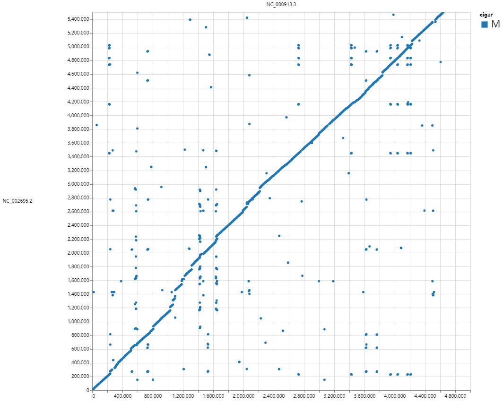
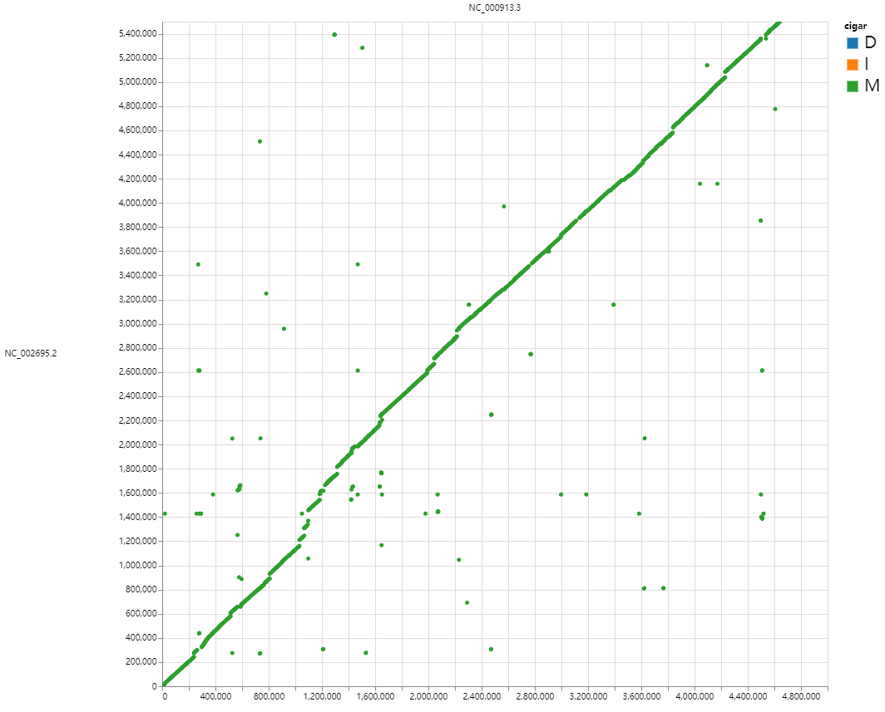
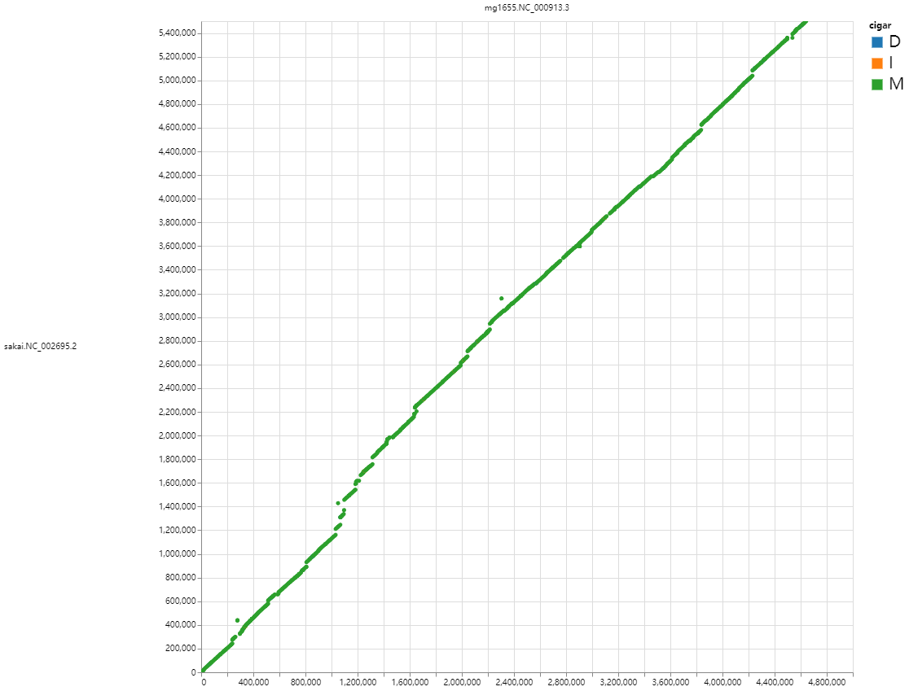
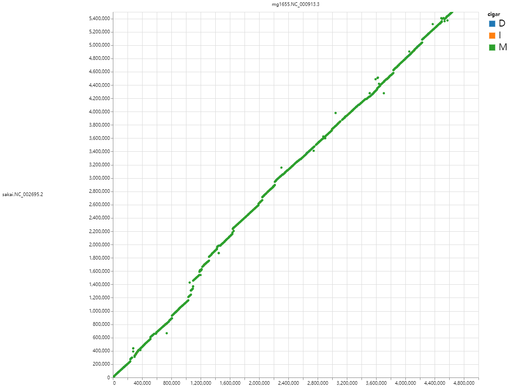

# E. coli genome

使用 MG1655 和 Sakai 两株大肠杆菌基因组，演示 `pgr` 的 UCSC pipeline 和比对可视化。
MG1655 是 K-12 实验室菌株，Sakai 是 O157:H7 致病菌株，两者基因组大小约 4.6 Mb 和 5.5 Mb。

## Download

```bash
# MG1655 (K-12)
curl -L https://ftp.ncbi.nlm.nih.gov/genomes/all/GCF/000/005/845/GCF_000005845.2_ASM584v2/GCF_000005845.2_ASM584v2_genomic.fna.gz |
    gzip -dc |
    pgr fa filter stdin --simplify |
    pgr fa gz stdin -o tests/genome/mg1655.fa.gz

# Sakai (O157:H7)
curl -L https://ftp.ncbi.nlm.nih.gov/genomes/all/GCF/000/008/865/GCF_000008865.2_ASM886v2/GCF_000008865.2_ASM886v2_genomic.fna.gz |
    gzip -dc |
    pgr fa filter stdin --simplify |
    pgr fa gz stdin -o tests/genome/sakai.fa.gz
```

## Alignment and visualization

```bash
# Pairwise alignment with FastGA
FastGA -v -pafx tests/genome/sakai.fa.gz tests/genome/mg1655.fa.gz > tmp.paf
FastGA -v -psl tests/genome/sakai.fa.gz tests/genome/mg1655.fa.gz > tmp.psl

# UCSC pipeline: chain → net → axt → maf
pgr pl ucsc -t="" tests/genome/mg1655.fa.gz tests/genome/sakai.fa.gz tmp.psl > tmp.chain.maf
pgr pl ucsc --syn -t="" tests/genome/mg1655.fa.gz tests/genome/sakai.fa.gz tmp.psl > tmp.syn.maf

# LASTZ alignment
# 1. Generate LAV with lastz (~2 min).  A pre-computed copy is saved in the
#    repo as tests/genome/mg1655-sakai.lastz.lav, so this step can be skipped.
lastz <(gzip -dcf tests/genome/mg1655.fa.gz) <(gzip -dcf tests/genome/sakai.fa.gz) \
    > tmp.lastz.lav
# 2. Convert LAV to PSL (use the saved LAV, or tmp.lastz.lav if regenerated).
lavToPsl tests/genome/mg1655-sakai.lastz.lav tmp.lastz.psl
pgr pl ucsc --syn -t="" tests/genome/mg1655.fa.gz tests/genome/sakai.fa.gz tmp.lastz.psl > tmp.lastz.maf

# Dotplot visualization
wgatools dotplot -f paf tmp.paf > tmp.html
wgatools dotplot tmp.chain.maf > tmp.chain.html
wgatools dotplot tmp.syn.maf > tmp.syn.html
wgatools dotplot tmp.lastz.maf > tmp.lastz.html
```

|  |  |
|:--------------------------:|:------------------------------:|
|            paf             |             chain              |

|  |  |
|:--------------------------:|:------------------------------:|
|            syn             |             lastz              |
